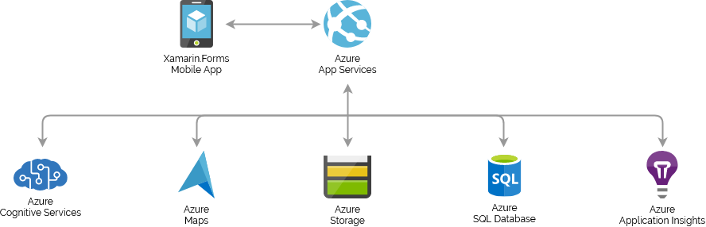

# One More Tree
One More Tree is a cloud native app with a .NET Core back-end and a Xamarin.Forms front-end built to explore a few of
the services provided by [Microsoft Azure](https://azure.microsoft.com) in the context of Cloud Computing course at the
University of Salerno.

Besides its technical purpose, One More Tree is designed to back a challenge where people around the world are
encouraged to plant new trees, take a picture and tag them to show their effort and hopefully raise awareness of climate
change.

## Architecture

The app relies on two main components:
- A Xamarin.Forms mobile app
- A .NET Core back-end

### Mobile App

    
    
    
    
    

The front-end is a simple [Xamarin.Forms](https://docs.microsoft.com/xamarin/xamarin-forms/) cross-platform mobile app
which has two tabs the user can interact with: a pull-to-refresh feed, where new posts are shown with all the relative
info, and a map, showing pins at each location where a tree has been tagged.

From the feed, the user can make a new post by tapping on the floating action button. A simple tap allows the user to
open the camera to instantly take a picture, while a longer one enables picking the picture from the gallery. Media
access is made easy by [MediaPlugin](https://github.com/jamesmontemagno/MediaPlugin) from James Montemagno.

After the picture selection, the user can add an optional description for the tree and geographically tag it. This can
be done by allowing the app to access the GPS of the device, done through
[Xamarin.Essentials](https://docs.microsoft.com/xamarin/essentials/) or by setting the location manually by opening the
map and tapping on it.

However the user is prompted for login when trying to make his first post through the app. Currently the only option
available is to login with Facebook in a server side-directed flow managed by
[WebAuthenticator](https://docs.microsoft.com/xamarin/essentials/web-authenticator) of Xamarin.Essentials.

The app also maintains a local SQLite database that is synchronized with the server-sided one in order to cache posts
and make them accessible even without connection as well as to save on mobile data.

### Back-End

The back end is made with a .NET Core app which exposes a RESTful API to make new posts, edit or remove them if the user
wishes allow client database synchronization. [Azure App Service](https://azure.microsoft.com/services/app-service/)
provides the environment to host the app with many related services.

This app is integrated with [Azure Cognitive Services](https://azure.microsoft.com/services/cognitive-services/) in
order to perform [image recognition](https://azure.microsoft.com/services/cognitive-services/computer-vision/) tasks
as well as content moderation so that only pictures on topic get actually stored.
[Azure Content Moderator](https://azure.microsoft.com/services/cognitive-services/content-moderator/) is also used for
the aforementioned task on descriptions the user can add to a picture.

[Azure Maps](https://azure.microsoft.com/services/azure-maps/) have been used for reverse address lookups as well as to
validate geographic coordinates and prevent users from tagging trees in the ocean, for example.

Pictures are stored as blobs through [Azure Storage](https://azure.microsoft.com/services/storage/) service while
metadata about them is kept in an [Azure SQL Database](https://azure.microsoft.com/services/sql-database/).
[Entity Framework Core](https://docs.microsoft.com/ef/core/) is chosen for the ORM.

Communications between the mobile app and the server are secured through the use of
[JWTs](https://en.wikipedia.org/wiki/JSON_Web_Token) while testing and debugging is made easier by
[Azure Application Insights](https://azure.microsoft.com/services/monitor/).

## Building and running

Even though this project is meant to be deployed in cloud, it's possible to test it locally by configuring a LocalDB and
[emulating the Azure Storage locally](https://docs.microsoft.com/azure/storage/common/storage-use-emulator), for the
back-end.

The .NET Core app can then be
[deployed locally on a IIS server](https://docs.microsoft.com/aspnet/core/host-and-deploy/iis/). The RESTful API exposed
can be queried with [Postman](https://www.postman.com/).

A few token are needed however to let the web app work with the services that cannot be emulated locally, like Computer
Vision, Content Moderator, Maps and Facebook. Also, JWT configuration must be defined. Every reference to these secret
tokens can be found in the [startup file](/BackEnd/Startup.cs) of the app.

The mobile app can be built for Android and it only needs a
[Google Maps API key](https://docs.microsoft.com//xamarin/android/platform/maps-and-location/maps/obtaining-a-google-maps-api-key)
to be put in the manifest. Enabling debugging options on a real device allows a real-world deployment but it is also
possible to test it with an emulator. Wherever the app is deployed, make sure it is able to access the local deployment
of the back-end.
